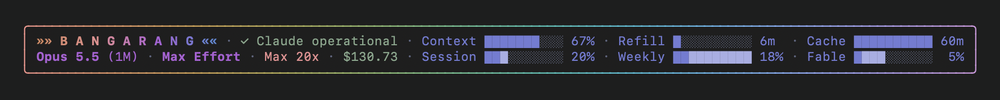

# Bangarang

A status line for Claude Code: everything worth watching in two rows, in a rainbow box.



## What it shows

- **Top row**: BANGARANG (or your own word), then Claude's service status from status.claude.com
  (`✓ Claude operational`, or `✕ Claude Outage` / `✕ Claude Maintenance` in amber, orange or red
  by severity), then bars for the context window, the time until your 5-hour limit refills, and
  how long the prompt cache stays warm.
- **Bottom row**: model, effort, fast mode, your plan and what the session has cost so far, then
  bars for the 5-hour and weekly limits, plus per-model limits such as Fable's if you turn them on.
- Limit numbers turn amber from 70% and red from 90%. The lighter cells on a limit bar show where
  your current pace lands by the time it resets.
- The rows line up as a table whatever the model, effort or status: BANGARANG grows or shrinks to
  take up the slack.

## Requirements

- macOS (it uses the BSD `stat` and `date` that ship with it; Linux isn't supported yet)
- Claude Code 2.1.278 or later, for the limit and cache numbers
- `jq` (`brew install jq`)
- A terminal with 24-bit colour on a dark background, about 125 columns wide. Made in Terminal.app
  with SF Mono.
- python3, only for running the tests

## Install

```sh
git clone https://github.com/AdamMackey/bangarang.git ~/Bangarang
cd ~/Bangarang
./install.sh
```

Then add this to `~/.claude/settings.json`:

```json
"statusLine": {
  "type": "command",
  "command": "~/.claude/statusline.sh",
  "refreshInterval": 60
}
```

It shows up at Claude Code's next refresh. `install.sh` runs the tests first and keeps any status
line you already had as `~/.claude/statusline.sh.bak`. Run it again after pulling updates.

### Per-model limits (optional)

Claude Code doesn't give status lines the per-model weekly limits (such as Fable's). Add `--usage`
to the command (`"command": "~/.claude/statusline.sh --usage"`), or set `BANGARANG_USAGE=1`, and
Bangarang runs Claude Code's own `/usage` headless every 10 minutes in the background to read them.
That makes no model call and costs nothing, but it does start a `claude` process, so it's off unless
you turn it on.

### Your own word

BANGARANG is the default. Swap in whatever word you like with `--phrase`:

```json
"command": "~/.claude/statusline.sh --phrase LFG"
```

or set `BANGARANG_PHRASE=LFG`. It gets the same letter-spacing, chevrons and rainbow, and still fits
the rows exactly. A short word in capitals looks best. Options go together, as in
`~/.claude/statusline.sh --usage --phrase LFG`.

## What it reads and fetches

- The session JSON Claude Code pipes to status lines: model, effort, fast mode, context window,
  cost, rate limits and the prompt cache.
- Your plan tier (`oauthAccount.organizationRateLimitTier`) from `~/.claude.json`, and nothing else
  from that file.
- status.claude.com's public status, fetched with curl in the background at most every 2 minutes; a
  verdict counts for 20 minutes.
- With `--usage`, Claude Code's `/usage` every 10 minutes.
- Its caches live in `~/Library/Caches/claude-statusline`.

## Tips

- `/color red` (or blue, green, yellow, purple, orange, pink, cyan) colours the prompt bar and
  session name just above the status line. That's Claude Code's, and it's per session.
- The line under the status line (`⏵⏵ auto mode on …`) belongs to Claude Code and can't be changed.

## Development

```sh
tests/run.sh          # the test suite (a throwaway HOME; your real cache is never touched)
tools/preview.sh      # renders tools/sample-payload.json to preview.png and prints it
```

- `tools/ansi2png.py` draws ANSI output to a PNG (SF Mono, hearts from Menlo) to check colours.
- `tools/tui-harness.py` runs a throwaway `claude --bare` in a pseudo-terminal and prints the screen
  it draws, through pyte (`python3 -m venv tools/venv && tools/venv/bin/pip install pyte`). It sets
  `CLAUDE_CODE_NO_FLICKER=1`, which forces the full-screen renderer and skips its boot canary:
  otherwise killing a full-screen launch within 10 seconds of its first frame counts a strike in
  `~/.claude.json`, and two strikes turn full-screen off for that version. `CLAUDE_CODE_SANDBOXED=1`
  skips the trust prompt without saving trust.
- `tools/*.swift` check font coverage and windows (`swift tools/fontcheck.swift`).

### Things learned the hard way

- Claude Code draws uncoloured status text as faint grey, so every piece has an explicit 24-bit
  colour. It repeats every colour code of the lines above at the start of each line, so long rows
  of codes (the box rules) end with a single reset.
- Claude Code only rewrites cells that changed, and Terminal.app can leave a row blank on screen
  after its window has been hidden, while its text buffer still holds it. A box that never changed
  would stay blank, so its colours step one unit of blue on odd minutes (invisible), and every
  refresh repaints it.
- SF Mono has the box-drawing glyphs, and its vertical line runs past the line height, so the sides
  join up.

## Support

Bangarang is free. If it saves you from a surprise limit or two, you can
[buy me a coffee](https://buymeacoffee.com/adammackey).

## License

MIT. Not affiliated with Anthropic.
